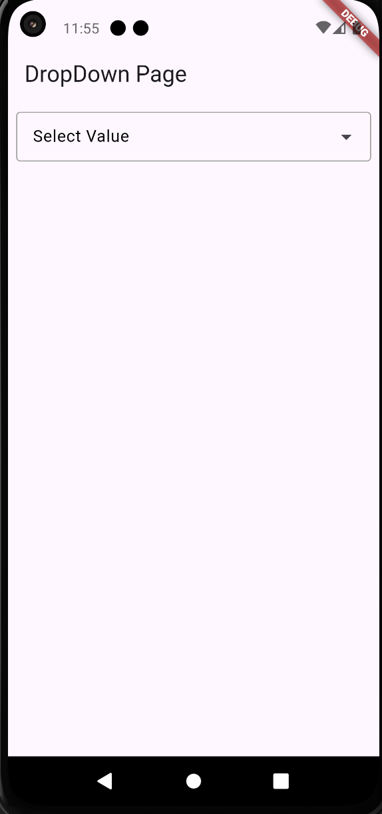

# Drop Down Radio Dialog Box

Drop Down Radio Dialog Box is a Flutter package that provides a customizable alert box with a list of radio buttons for selecting a value. This package is useful for scenarios where you need to prompt users to choose an option from a list within a dialog box.




## Features

* Display a list of selectable items inside an alert dialog.
* Customizable text field title and alert title.
* Supports custom button texts for confirmation and cancellation.
* Allows binding of selected value and ID.
* Easy to integrate and use in your Flutter project.

## Installation

Add the following to your `pubspec.yaml`:

```yaml
dependencies:
  drop_down_radio_dialog_box: ^0.0.3
```

Then, run:

```bash
flutter pub get
```

## Usage

Here’s a basic example of using the Drop Down Radio Dialog Box:

```dart
AlertBoxTextFiled(
  // Text field title name
  textFiledTitle: "Select Value",
  // Alert title name
  alertTitle: "Select Item",
  // Add items
  items: const [
    "Item 1",
    "Item 2",
    "Item 3",
    "Item 4",
  ],
  itemsId: const [],
  selectedValue: selectedValue,
  selectedIdValue: selectedIdValue,
  controller: controller,
  confirmButtonText: "Ok",
  cancelButtonText: "Cancel",
)
```

### Parameters

* `textFiledTitle` - Title for the text field.
* `alertTitle` - Title for the alert dialog.
* `items` - List of items to display as radio buttons.
* `itemsId` - List of item IDs (optional).
* `selectedValue` - Variable to hold the selected value.
* `selectedIdValue` - Variable to hold the selected ID.
* `controller` - TextEditingController for managing input.
* `confirmButtonText` - Text for the confirmation button.
* `cancelButtonText` - Text for the cancellation button.

## License

This package is licensed under the MIT License. See the LICENSE file for more information.
